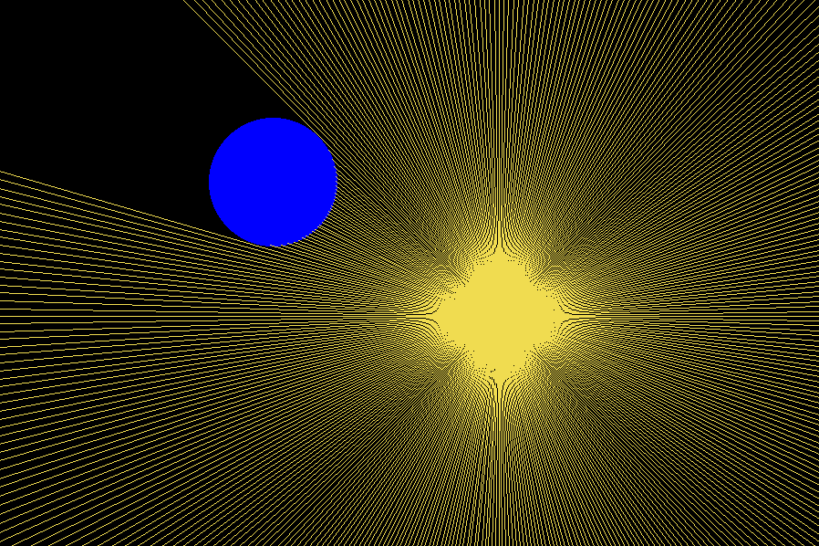
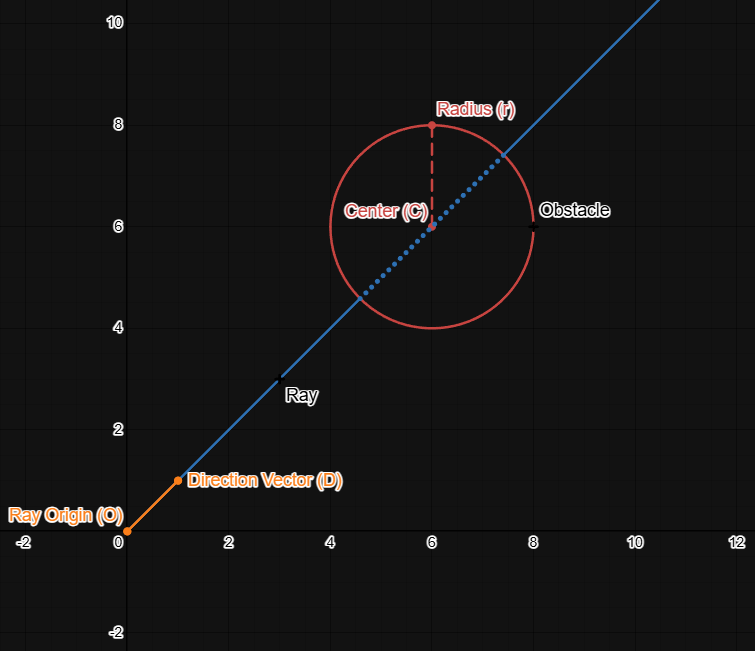

# RayTracing

RayTracing is a simple C project that demonstrates basic ray tracing techniques for rendering 2D scenes. The project is designed for educational purposes and provides a minimal implementation to help understand the fundamentals of ray tracing. See [Ray Generation](#ray-generation-and-intersection-computation) for implementation details.

## Features
- Renders simple 2D scenes using ray tracing
- Interactive light source



## Directory Structure
```
RayTracing/
├── src/
    ├── main.c           # Entry point for the application
    ├── raytracing.c     # Core ray tracing logic
    ├── raytracing.h     # Header for ray tracing functions
    ├── makefile         # Build instructions
├── README.md            # Features documentation for ray generation

```

## Building
### Prerequisites

- GCC compiler
- SDL2 development libraries

#### Installing SDL2

**Ubuntu/Debian:**
```bash
sudo apt-get install libsdl2-dev
```

**macOS (Homebrew):**
```bash
brew install sdl2
```

**Windows:**
- Download SDL2 development libraries from [libsdl.org](https://www.libsdl.org/download-2.0.php)
- Extract and configure your compiler to find the headers and libraries

### Compile

```bash
make
```

### Run

```bash
./raytracing
```

## License
This project is licensed under the MIT License. See the LICENSE file for details.

## Author
Gabe Gamble

---


# Ray Generation and Intersection Computation

Where given a `ray`, the number of rays to be generated `num_rays`, and the point `origin` from which each ray is emmited. Since rays are emmited in all directions ($360^\circ$) we can compute the angle $\Theta$ at which each `ray` need to be drawn:
$$
\Theta=\frac{360^\circ}{\text{num\_rays}}
$$
Now, we can assume that a `ray` is represented by a position vector $\vec{O}=\langle{x,y}\rangle$ which is its origin, and a normalized direction vector $\vec{D}=\langle{\cos\Theta,\sin\Theta}\rangle$.

---

### Rays that do not encounter obstacles
For rays that do not collide with an obstacle, you can simply compute $\vec{D}$ and multiply by some scalar for sufficient length.

SDL2 provides a method `SDL_RenderDrawLine()` that will draw a line that connects two points: $(x_1,y_1) , (x_2,y_2)$. Therefore generating a ray with no obstacles would look like:
```C
// convert to radians
float theta = (360.0 / num_rays) * M_PI / 180.0; 
float end_x = ray.origin.x + cos(theta) * RAY_SCALE;
float end_y = ray.origin.y + sin(theta) * RAY_SCALE;
SDL_RenderDrawLine(ray.origin.x, ray.origin.y, end_x, end_y);
/* note code is not syntactically correct, just used for examples. See SDL2 documentation for proper usage */
```

---

### Rays that do encounter obstacles
Generating rays that do collide with an obstacle is slightly more involved. First, we need to check if a ray will collide with an obstace. Again, lets assume that a `ray` is represented by a position vector $\vec{O}=\langle{x,y}\rangle$, and a normalized direction vector $\vec{D}=\langle{\cos\Theta,\sin\Theta}\rangle$. Now lets introduce a circular `obstacle` that is represented by a position vector for its center $\vec{C}=\langle{x,y}\rangle$ and a radius $r$.



From this, we can calculate a position vector $\vec{P}$ for any point along the ray:
$$
\vec{P}=\vec{O}+t\vec{D},\;t\geq0
$$
Now, we can see that an intersetion with the object occurs when the distance between $\vec{P}$ and $\vec{C}$ is less than or equal to $r$, or:
$$
\|\vec{P}-\vec{C}\|\leq r
$$
If we substitute $\vec{P}$ back into the equation, we have:
$$
\|(\vec{O}+t\vec{D})-\vec{C}\|\leq r
$$
Since the `norm`, $\|\vec{P}-\vec{C}\|$ is just shorthand for the distance formula $d = \sqrt{(P_1-C_1)^2+(P_2-C_2)^2}$, we can square both sides to remove the square root.
$$
\|(\vec{O}+t\vec{D})-\vec{C}\|^2\leq r^2
$$
To help simplify, we'll let $f=\vec{O}-\vec{C}$:
$$
\|(f+t\vec{D})\|^2\leq r^2
$$
Expand:
$$
f^2+2t(fD)+t^2D^2=r^2
$$
Now we can put the expression in terms of $t$ to get the quadratic equation:
$$
D^2t^2+2fDt+f^2-r^2=0
$$
Now we can use the quadratic equation to determine **if** a collision has been made and **where** it was made.
$$
\text{Quadratic Equation}:t=\frac{-b\pm\sqrt{b^2-4ac}}{2a}
$$

### `If` a collision has been made
From the quadratic eqaution, we know that the discriminant $\Delta=b^2-4ac$ can tell us how many roots a quadratic equation has. 
$$
\begin{align*}
\Delta&>0 \implies 2\;\text{distinct\;real\;roots}\\
\Delta&=0 \implies 1\;\text{repeated\;real\;root}\\
\Delta&<0 \implies \text{complex\;(imaginary)\;roots}
\end{align*}
$$
Or in our case:
$$
\begin{align*}
\Delta&>0 \implies 2\;\text{collisions}\\
\Delta&=0 \implies 1\;\text{collision\;(tangent\;line)}\\
\Delta&<0 \implies \text{no\;collisions}
\end{align*}
$$
So to check if a collision has been made, we can save computing power by just calculating the discriminant and checking if it is greater than or equal to zero. Lets first remind ourselves of our quadratic:
$$
D^2t^2+2fDt+f^2-r^2=0
$$
In this case:
$$
\begin{align*}
a&=D^2=\vec{D}\cdot\vec{D}\\
b&=2fD=2(\vec{O}-\vec{C})\cdot\vec{D}\\
c&=f^2-r^2=(\vec{O}-\vec{C})\cdot(\vec{O}-\vec{C})-r^2
\end{align*}
$$
Therefore the discriminant $\Delta=b^2-4ac$ is:
$$
\Delta=(2(\vec{O}-\vec{C})\cdot\vec{D})^2-4(\vec{D}\cdot\vec{D})((\vec{O}-\vec{C})\cdot(\vec{O}-\vec{C})-r^2)
$$

One note to be made is that, since $\vec{D}$ is a normalized (unit) vector, its magnitude is 1, which means: $$a=\vec{D}\cdot\vec{D}=\|\vec{D}\|=1$$

In C:
```C
// Check for intersection using discriminant
Vect2D F = vSubtract(ray.origin, obstacle.center); // Vector from ray origin to circle center
float a = 1; // a = ray.direction ⋅ ray.direction, since ray.direction is normalized, a = 1
float b = 2 * vDot(F, ray.direction); // b = 2 * (f ⋅ ray.direction)
float c = vDot(F, F) - (obstacle.radius * obstacle.radius); // c = (f ⋅ f) - r^2
float discriminant = (b * b) - 4 * a * c; // Discriminant of quadratic equation
```

And if $\Delta\geq0$ we can use the quadratic formula to determine where the collision was made

### `Where` the collision was made
Previouslty we stated that the ray intersects a circular obstacle at $\vec{P}=\vec{O}+t\vec{D}$ for some $t\geq0$ sastisfying:
$$
\|\vec{P}-\vec{C}\|\leq r
$$
Now that we have solved for the discriminant, we can easily solve for such $t$ and use it to compute the point $\vec{P}$ which would represent the point of intersection.
$$
t=\frac{-b\pm\sqrt{b^2-4ac}}{2a}=\frac{-b\pm\sqrt{\text{discriminant}}}{2a}
$$
In C:
```C
float t1 = ((-b - sqrt(discriminant)) / (2 * a));
float t2 = ((-b + sqrt(discriminant)) / (2 * a));
```
If the ray intersects the obstacle in the forward direction, at least one of these solutions for $t$ will be positive and correspond to a valid point of intersection. This is because: 
- If both $t_1$ and $t_2$ are negative, both intersection points are “behind” the ray’s origin, so the ray does not hit the circle in the direction it is cast.
- If at least one $t$ is positive, the intersection occurs at or in front of the ray’s origin, which is a valid hit for ray tracing. 
- In practice, you use the smallest positive $t$ to find the first intersection point along the ray.

To solve for this point, recall that a point along the ray is given by $\vec{P}=\vec{O}+t\vec{D}$. Simply plug $t$ into the equation and that will be your point of intersection. Then draw a line from the rays origin to that point.

In C:
```C
if(t1 >= 0)
{
    // P is a point along the array where P = O + tD, where O = ray.origin and D = ray.direction
    Vect2D tD = vScalarMult(t1, ray.direction);
    Vect2D P = vAdd(ray.origin, tD);
}
else if(t2 >= 0)
{
    // P is a point along the array where P = O + tD, where O = ray.origin and D = ray.direction
    Vect2D tD = vScalarMult(t2, ray.direction);
    Vect2D P = vAdd(ray.origin, tD);
}
SDL_RenderDrawLine(ray.origin.x, ray.origin.y, P.x P.y);
```
